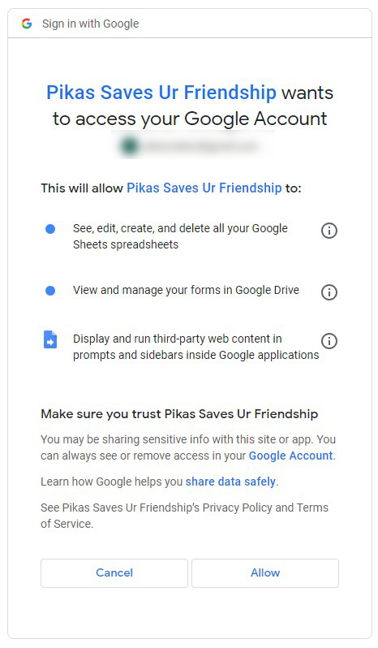

# Google-Forms-Generator-for-Preventing-Breakup
This Google Form Generator is designed to facilitate the rapid creation of Google Forms, which can save your friendship before traveling by allowing you to swiftly convert some fantastic questions in [this Google Sheet](https://docs.google.com/spreadsheets/d/1MgWS0RFdOLshZZiJTdjAvHDp7Xj8YXzqo2zoqaXyxt4/edit?usp=sharing) into a structured Google Form.

## Preparison
By clicking "File">>"Make a copy" in [this Google Sheet](https://docs.google.com/spreadsheets/d/1MgWS0RFdOLshZZiJTdjAvHDp7Xj8YXzqo2zoqaXyxt4/edit?usp=sharing), a  new one will be duplicated to your Google Drive, which means you have the permission to edit it.

 ㅤ
<p align="center">
  
  
  <br>
  <em>▲ How to make a copy ▲</em>
  <br>
</p>

 ㅤ
Then you have to give me permission to run the main program by clicking the  `Generation Button` on the left bottom.

 ㅤ
<p align="center">
  
  <br>
  <em>▲ Generation Button ▲</em>
  <br>
</p>


 ㅤ
<p align="center">
  
  <br>
  <em>▲ Click "Continue" to give permission ▲</em>
  <br>
</p>

 ㅤ


 ㅤ
<p align="center">
  
  
  <br>
  <em>▲ After choosing your account, click "Advance" and "Go to Pikas Saves Ur Friendship (unsafe)"  ▲</em>
  <br>
</p>

 ㅤ


 ㅤ
<p align="center">
  
  <br>
  <em>▲ Finally, click "Allow" to finish authorization ▲</em>
  <br>
</p>

 ㅤ
If you're worried about the safety of my code, click "Extensions" >> "Apps Script" and you'll see the following codes of Apps Script that perform the conversion:

```javascript
  // Get the current Google Sheets file
  var sheet = SpreadsheetApp.getActiveSpreadsheet().getActiveSheet();

  // Get values and font weights of all cells
  var data = sheet.getDataRange().getValues();
  var fontWeights = sheet.getDataRange().getFontWeights();
  var fontStyles = sheet.getDataRange().getFontStyles();

  // Get the name of the current Google Sheets and use it as the form name
  var formName = SpreadsheetApp.getActiveSpreadsheet().getName();
  var form = FormApp.create(formName);
  
  //
  var nameItem = form.addTextItem();
  nameItem.setTitle('What\'s your name?').setRequired(true);

  // Get options from B3
  var options = data.slice(2).map(function(row) {
    return row[1];
  }).filter(function(option) {
    return option; // Remove undefined or empty strings
  });

  // Loop from column C (index 2) to create titles and questions
  for (var i = 2; i < data[1].length; i++) {

    // Add a new page if A1 is not "MERGE" and set its title
    if (data[0][0].toUpperCase() !== "MERGE") {
      var page = form.addPageBreakItem();
      page.setTitle(data[1][i]);
    } else {
      var sectionHeader = form.addSectionHeaderItem();
      sectionHeader.setTitle(data[1][i]);
    }

    // Loop from the third row to create questions
    for (var j = 2; j < data.length; j++) {
      var questionTitle = data[j][i];
      if (questionTitle) {
        if (fontStyles[j][i] === "italic") {
          // if italic then addTextItem
          var item = form.addTextItem();
          item.setTitle(questionTitle);
        } else {
        // Add a multiple-choice item and set its title and options
          var item = form.addMultipleChoiceItem();
          item.setTitle(questionTitle)
              .setChoiceValues(options);
        }
        if (fontWeights[j][i] === "bold") {
          item.setRequired(true);
        }
      }
    }
  }

  // Display a dialog with the form URL
  var formUrl = form.getPublishedUrl();
  var htmlOutput = HtmlService.createHtmlOutput('You can access it <a href="' + formUrl + '" target="_blank">here</a>.')
                             .setWidth(300)
                             .setHeight(80);
  SpreadsheetApp.getUi().showModalDialog(htmlOutput, 'Form Created!');
}
```

## Usage

Here's a breakdown of what the script does:

1. **Retrieving the Sheet Details**: The script first retrieves the active Google Sheets file and extracts all necessary details, including cell values and their respective styles (like font weight and font style).

2. **Form Creation**:
   - The script uses the name of the current Google Sheets as the form name.
   - It adds a text item, prompting the user to enter their name, which is a mandatory field.

3. **Question Generation**:
   - The script reads options from column B (starting from B3) and uses them as the choices for multiple-choice questions.
   - It iterates through each column from C onwards, setting the column title as the page or section title and adding respective questions from each cell in the column.
   - If a question is in bold, it's marked as a required question.
   - If a question is in italics, it's created as a text item instead of a multiple-choice question.

4. **Form URL Display**: Once the form is created, the script displays a dialog box containing the URL of the newly created form.

## Reference

To run the script, click on the embedded picture button next to your sheet. The script will execute, and upon completion, you will see a dialog box with a link to your newly created form.
